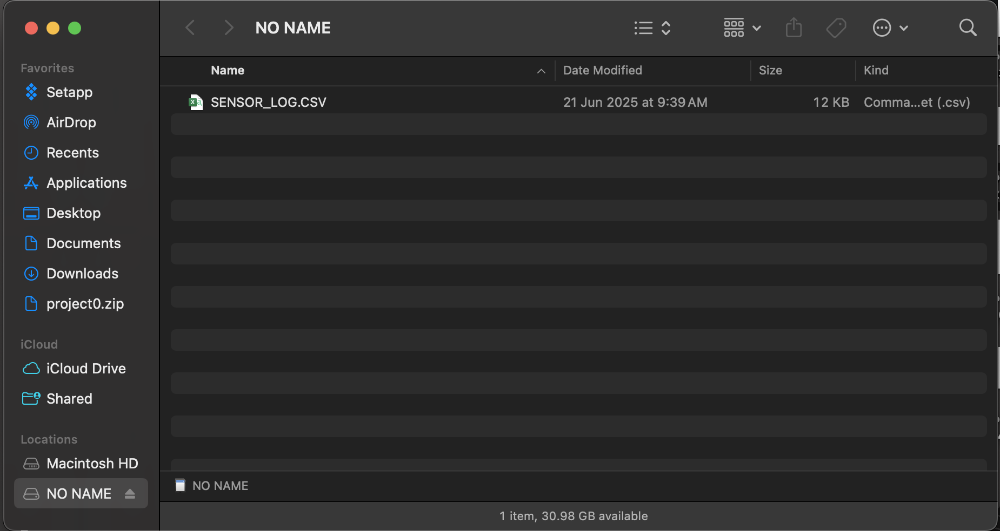

[Frame Construction](frame-build-guide.md) | [Sensor Pod Housing](sensor-pod-build-guide.md) | [Electronics Assembly](electronics-build-guide.md) | [Master Manual](https://docs.google.com/document/d/18Mj6dGt3YCFpkhXhR96WbZqG3Laaa05PJXKUIPMrM2g/edit?tab=t.0) | [Code File](https://github.com/rishimukherjee31/LCCMR/blob/main/codes/deploy.ino)

<div align="center">
  
  <p><em>Jar Jar ROV</em></p>
</div>
<br>
<br>


## Table of Contents
1. [Quick Start](#quick-start)
2. [Libraries](#libraries)
3. [Setup & Variables](#setup--variables)
4. [LED Status on the Boron](#led-status-on-the-boron)
5. [Data Output](#data-output)
6. [Sensor Data Extraction](#sensor-data-extraction)
7. [Troubleshooting](#troubleshooting)

<br>

## Quick Start


The Sensor Pod uses a [Particle Boron Microcontroller](https://store.particle.io/products/boron-lte-cat-m1-noram-with-ethersim-4th-gen?srsltid=AfmBOorGyjtaKMBeFM4IDkFqGIA-umYWDAvHu_w6I5nC4h2ciwpgvu81). To program this device, we use the [Particle Web IDE](https://build.particle.io/build/new). The code in this GitHub is written to run on Boron microcontrollers. Our main use case is to log water quality data and GPS coordinates to an SD card using the Boron. 

Like most microcontrollers, the Boron needs firmware to run. We have prepared this firmware in ```deploy.ino``` that can be found in the ```/code``` directory. This file contains code written in C++. You will need to download or copy this code into the Web IDE. Type the following commands in your terminal:

<br>

> This will 'clone' or download this repository to your machine. You can then navigate to the codes folder to access the firmware.

<br>

```bash
git clone https://github.com/rishimukherjee31/LCCMR.git
cd codes
ls
```

<br>

1. Flash the `./codes/deploy.ino` file to Particle Boron through the Web IDE
2. Insert the SD card into Adalogger
4. Power on and monitor the LED status. When the LED on the Boron flashes blue, it is connected to the web. (You only need to monitor this once)

<br>

## Libraries

Auto-included by Particle IDE:
- `Adafruit_GPS`
- `SdFat` 
- `PublishQueueAsyncRK`
- `elapsedMillis`

> If you are using the code for the first time, you will need to include these libraries manually. You will need to add these libraries using the tools provided by the Web IDE. These will automatically get added to your project once you make the right selections. 

<br>

## Setup & Variables

The following variables can be modified within the code as needed. ```RECORD_PERIOD``` is an integer constant that specifies the resolution of samples logged in milliseconds. The default value is 2000 ms, which records a sample every 2 seconds. ```SEND_PERIOD``` is the time before a message is sent to the website. In our code, it is 10 seconds. The calibration constants can be adjusted based on the readings and the expected values. The Turbidity and Dissolved Oxygen sensors don't need to be calibrated. 

<br>

```cpp
int RECORD_PERIOD = 2000;        // Sensor reading interval (ms)
int SEND_PERIOD = 10000;         // Data transmission interval (ms)
int MAX_DATA_PER_PACKET = 10;    // Max readings per transmission

// Calibration constants
float ph_calibration = 15.509;
float temp_calibration = -107;
float do_calibration = 20.0;
```

<br>


## LED Status on the Boron

- **Blue**: Transmitting data/ Connected
- **Green**: SD card initialized successfully
- **Red**: SD card initialization failed

> For the most part, you will only see the green and blue lights on your Boron device. When the Boron initially powers up, the green light will blink until the device can connect to the internet. Once that occurs, the LED onboard the device will change colors to blue. 

<br>

## Data Output

On the [Particle Console](https://console.particle.io/) you will see a ```water_data``` variable that contains the following data structure:

```json
{
  "robotID": 0,
  "tmp": [22.5],
  "ph": [7.2],
  "do": [8.4],
  "turb": [12.3],
  "lat": [40.123456],
  "lon": [-74.654321],
  "timestamp": [112]
}
```

> This is not necessary for the SD card logging process; rather, the console helps you see the data collected by the Boron to aid with troubleshooting. Whenever the Boron can connect to the internet, you will be able to see that through the console. 

<br>

**SD Card (CSV):**

<br> 

The columns in the CSV file are as follows:

```
Time,      Latitude,   Longitude,   Temperature,   pH,   Dissolved Oxygen,   Turbidity
00:30:25,  40.123456,  -74.654321,  22.5,          7.2,  8.4,                12.3
```

<br> 

### Sensor Data Extraction

The data extraction process should follow the following guidelines for the website to read the data reliably.

<br>

**Critical** - Do this immediately after retrieving the sensor pod from water:

- Turn off the Boron device using the switch
- Wait for all LEDs to completely turn off
- This step prevents data corruption during SD card removal
- **Do not skip this step** - always power down first

### Remove the SD Card

- Gently remove the SD card from the Featherboard in the middle
- Insert the SD card into your card reader, then connect to your computer

<br>

<div align="center">
  
  <p><em>Sensor Log file in the computer's filesystem</em></p>
</div>

<br>

### Rename Data File and Data Cleanup

For the website to properly read your file, you need to rename the file (`SENSOR_LOG.CSV`) using the following convention:

```
<Team name>_<Lake name>_<Date as mm-dd-yyyy>_<Time as hhmm 24h-hour>.csv
```

**Example:**
```
R2-H2O_Square-Lake_06-07-2025_1240.csv
```

Where:
- **Team name:** R2-H2O
- **Lake name:** Square-Lake  
- **Date as mm-dd-yyyy:** 06-07-2025
- **Time as hhmm 24-hour:** 1240

<br>

**Important naming rules:**
- Use underscores (`_`) as spacers between categories only
- Using dashes (`-`) is fine within a category such as Date
- This naming convention is critical as the code relies on it to read uploaded data files reliably

<br>

### Data Cleanup

Check your CSV file, specifically the bottom end of the file. If you can locate the row where you exited the water, remove all rows after that point in the CSV file. You are essentially cleaning up data that is inaccurate and doesn't reflect the testing environment.

Look for a row near the bottom where all the columns change at roughly the same time - this is probably the point where the sensor pod left the water. If you are unable to locate this point, upload the data as is.

<br>

## Troubleshooting

| Issue | Solution |
|-------|----------|
| SD card error | Format as FAT32, check D5 connection |
| No GPS fix | Wait 2-5 minutes, ensure clear sky view |
| Sensor readings off | Adjust calibration constants |
| Housing leaks | Check PVC cement joints, ROV penetrators |

