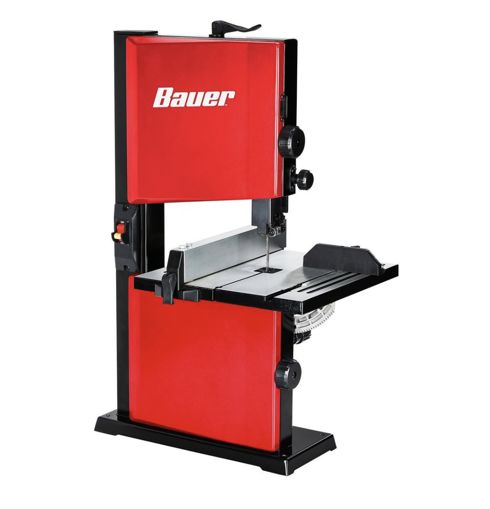
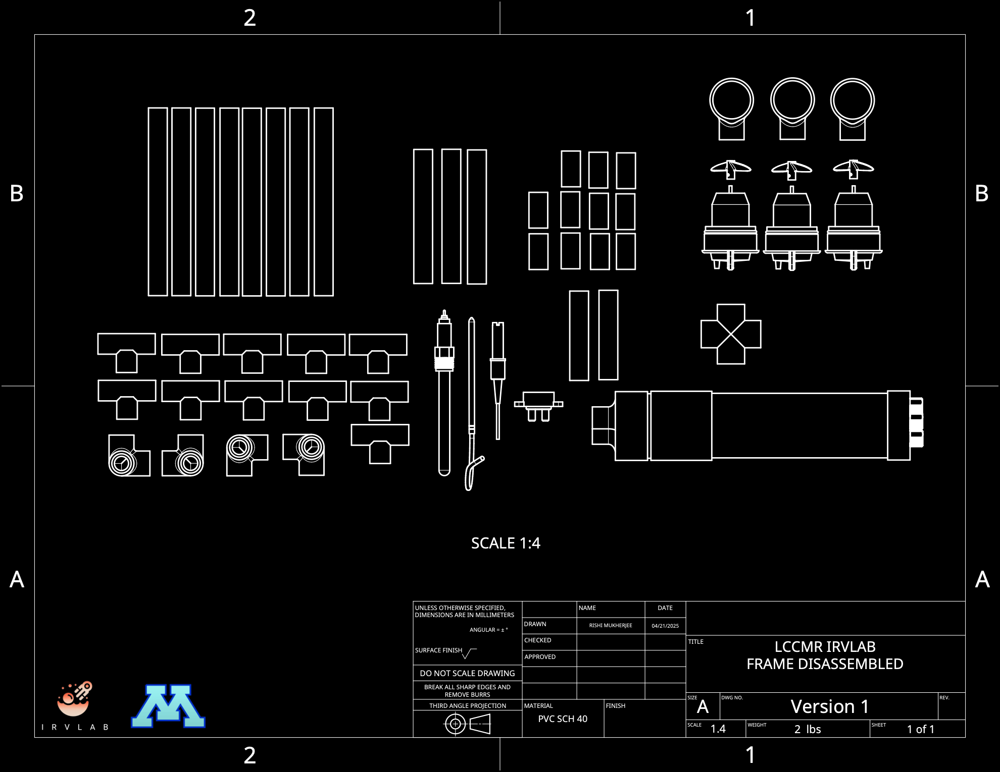

# Water-Quality-Project

The ROV has two main components to it: the frame, the electronics and thruster kit. We are using the Sea Mate Angelfish kit, which comes with a set of thrusters, cabling, and a control box. Let us begin by creating the frame first. 

## Frame Fabrication and Assembly Guide

  
  
<em>JAR JAR ROV Complete Frame</em>

 
Welcome to the assembly guide for your LCCMR IRV LAB JAR JAR ROV frame! This guide will walk you through each step of assembling your ROV frame using PVC SCH 40 materials.

 

## Parts List

### 1. Frame Parts:

<table align="left-center">
  <tr>
    <th>Item</th>
    <th>Quantity</th>
    <th>Picture</th>
  </tr>
  <tr>
    <td><a href="https://www.homedepot.com/p/Charlotte-Pipe-1-2-in-PVC-Schedule-40-S-x-S-x-S-Tee-PVC024000600HD/203812195">1/2" PVC Tee</a></td>
    <td align="center">11</td>
    <td></td>
  </tr>
  <tr>
    <td><a href="https://www.homedepot.com/p/Charlotte-Pipe-1-2-in-x-10-ft-PVC-Schedule-40-Plain-End-Pipe-PVC-04005-0600/100348471">1/2"x10' PVC pipe</a></td>
    <td align="center">1</td>
    <td></td>
  </tr>
  <tr>
    <td><a href="https://www.homedepot.com/p/Charlotte-Pipe-2-in-x-2-ft-PVC-DWV-Schedule-40-Pipe-PVC072000200HA/100585960">2" PVC Pipe, 2 ft.</a></td>
    <td align="center">1</td>
    <td></td>
  </tr>
  <tr>
    <td><a href="https://www.homedepot.com/p/Charlotte-Pipe-1-2-in-PVC-Side-Outlet-90-Degree-S-x-S-x-S-Elbow-Fitting-PVC025100600HD/300335067">1/2" PVC 4-way Elbow</a></td>
    <td align="center">4</td>
    <td></td>
  </tr>
  <tr>
    <td><a href="https://www.walmart.com/ip/Hollow-Swimming-Rod-Hollow-Foam-Pool-Noodles-P8C8/5796385463?classType=VARIANT&athbdg=L1400&selectedSellerId=101664769">Pool Noodle</a></td>
    <td align="center">1</td>
    <td></td>
  </tr>
</table>

 

### 2. Required Tools:

<table align="left-center">
  <tr>
    <th>Tool</th>
    <th>Image</th>
  </tr>
  <tr>
    <td>Band Saw</td>
    <td></td>
  </tr>
  <tr>
    <td>PVC Pipe Cutter</td>
    <td></td>
  </tr>
  <tr>
    <td>Rubber Mallet</td>
    <td></td>
  </tr>
  <tr>
    <td>Measuring Tape</td>
    <td></td>
  </tr>
  <tr>
    <td>Cutter</td>
    <td></td>
  </tr>
</table>
 

> You need either a band saw or a PVC pipe cutter. You can use a hack saw, but it takes more effort and is more time consuming. 

## Fabrication  Guide

The disassembled frame can be seen below. We need to fabricate these parts from our materials before we can assemble the frame. It is reccomended to start with the 1/2" pipe. Once the pipe pieces are cut, we can start assembling the frame. Some of the parts are from the Sea Mate Angelfish ROV kit. Those parts are essential to assembling the frame. They are not necessary in the fabrication process for the frame. The Sensor kit is also not necessary at this stage. 

 

  
  
<em>JAR JAR ROV Disassembled Frame</em>

 

### Main Frame Components
| Qty | Description | Size | Notes |
|-----|-------------|------|-------|
| 8 | Long vertical pipes | Standard length | Frame uprights |
| 3 | Medium horizontal pipes | Standard length | Cross members |
| 3 | Short horizontal pipes | Standard length | End supports |
| 4 | Base pipes | Standard length | Bottom frame |
| 2 | Long mounting pipes | Standard length | Top supports |
| 4 | Short mounting pipes | Standard length | Bottom supports |

### Connectors
| Qty | Description | Type | Notes |
|-----|-------------|------|-------|
| 10 | T-connectors | PVC | Frame corners |
| 8 | 90° elbow connectors | PVC | Corner joints |
| 4 | End caps | PVC | Pipe termination |
| 1 | Cross connector | PVC | Central junction |

### Mounted Components
| Qty | Description | Type | Notes |
|-----|-------------|------|-------|
| 3 | Mounting clamps | Metal/PVC | Thruster mounts |
| 3 | Thrusters | | Upper propulsion |
| 1 | Control box | | Main electronics |
| 1 | Tether connector | | Communication cable |

## Assembly Instructions

### Step 1: Base Frame Assembly
<!-- Step 1 Image: Show base frame assembly diagram -->

1. Connect four corner T-connectors to create a rectangular base
2. Insert the base pipes to connect all corners
3. Ensure all connections are pushed in completely

### Step 2: Vertical Support Installation
<!-- Step 2 Image: Show vertical pipe installation -->

1. Insert vertical pipes into the base frame T-connectors
2. Add additional T-connectors at the midpoint for cross supports
3. Ensure all vertical pipes are the same height

### Step 3: Cross Member Installation
<!-- Step 3 Image: Show horizontal cross member installation -->

1. Connect horizontal cross members to the mid-height T-connectors
2. Install the central cross connector
3. Attach remaining horizontal pipes to create the middle tier

### Step 4: Top Frame Assembly
<!-- Step 4 Image: Show top frame assembly -->

1. Install top T-connectors on vertical pipes
2. Connect top horizontal pipes
3. Add end caps to exposed pipe ends

### Step 5: Thruster Mount Installation
<!-- Step 5 Image: Show thruster mount installation -->

1. Position mounting clamps on top horizontal members
2. Attach thrusters to clamps following manufacturer instructions
3. Ensure thrusters are aligned properly for control

### Step 6: Control Box Installation
<!-- Step 6 Image: Show control box installation -->

1. Secure control box to central position on frame
2. Route tether connector to appropriate position
3. Double-check all electrical connections

### Step 7: Final Assembly Check
<!-- Step 7 Image: Show completed assembly -->

1. Verify all connections are secure
2. Check frame alignment and squareness
3. Test fit in water chamber if available

## Important Notes

- Material: PVC SCH 40
- Total weight: Approximately 2 lbs
- Drawing scale: Various (1:5, 1:6, 1:12, 1:4.5)
- Frame design by Rishi Mukherjee, LCCMR IRV LAB
- Drawing dates: 04/15/2025 and 04/21/2025

## Safety Guidelines

1. Wear appropriate safety equipment during assembly
2. Apply PVC cement in well-ventilated area
3. Allow adequate curing time before water testing
4. Double-check all connections before deployment

## Troubleshooting

| Issue | Solution |
|-------|----------|
| Loose connections | Apply PVC cement or use friction-fit O-rings |
| Uneven frame | Check vertical pipe lengths and re-level |
| Thruster misalignment | Adjust mounting clamps and re-secure |

## Maintenance

1. Regularly inspect all connections for wear
2. Clean frame after each saltwater use
3. Check thruster mounting bolts periodically
4. Store in dry environment when not in use

---

*For additional support, contact LCCMR IRV LAB*

*Version 1 REV.2 - April 2025*
