# Frame Fabrication and Assembly Guide

The ROV has two main components to it: the electronics, the frame + thruster kit. We are using the Sea Mate Angelfish ROV kit, which comes with a set of thrusters, cables, and a control box. Begin by creating the frame. 

  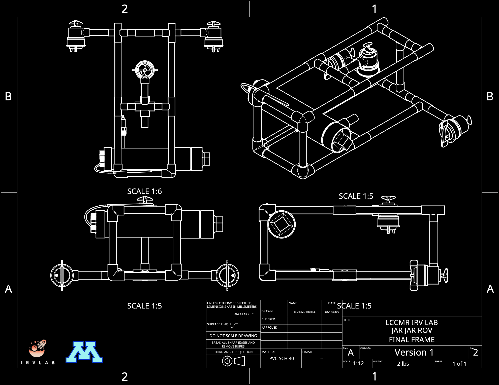
  
<em>JAR JAR ROV Complete Frame</em>

 

## Quick Links

- [Parts List](#parts-list)
- [Fabrication Guide](#fabrication-guide)
- [Assembly Guide](#assembly-guide)
- [Ballasting](#ballasting)

 

## Parts List

### 1. Required Tools:

<table align="center">
  <tr>
    <th>Band Saw</th>
    <th>PVC Pipe Cutter</th>
    <th>Rubber Mallet</th>
    <th>Measuring Tape</th>
    <th>Cutter</th>
  </tr>
  <tr>
    <td></td>
    <td>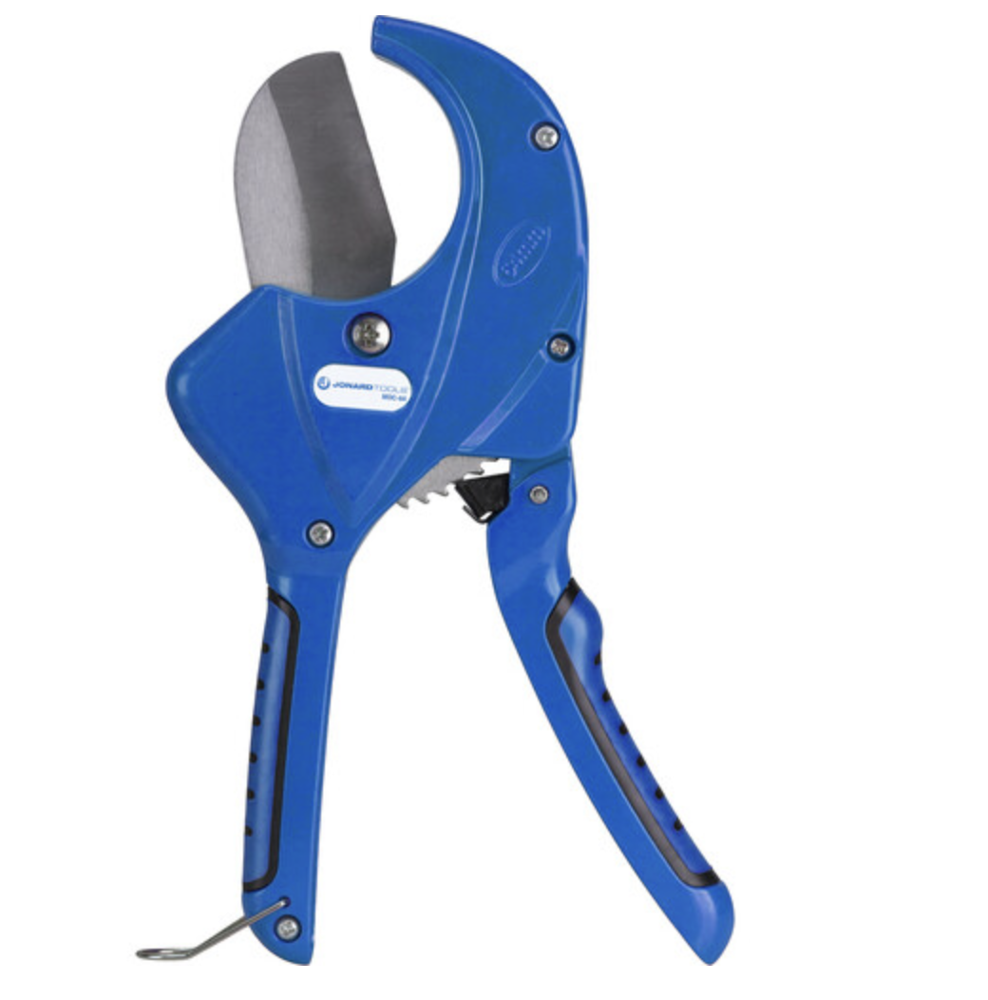</td>
    <td></td>
    <td>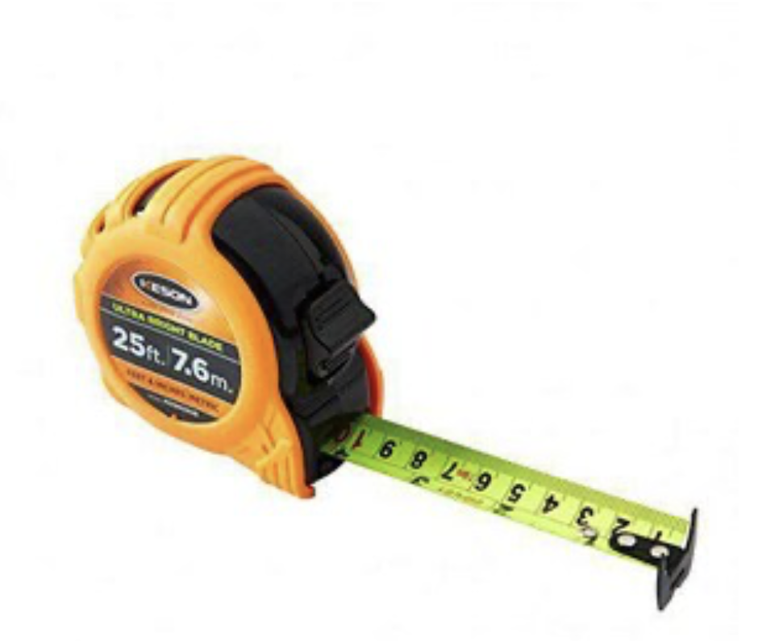</td>
    <td></td>
  </tr>
</table>

> You need either a band saw or a PVC pipe cutter. You can use a hack saw too, but it takes more effort and is more time consuming. When cutting pipes, make sure to account for the kerf. Kerf refers the thickness of the blade in the material. This thickness of material is lost. This problem is more obvious when using saws. 

 

### 2. Raw Materials:

<table align="left-center">
  <tr>
    <th>Item</th>
    <th>Quantity</th>
    <th>Picture</th>
  </tr>
  <tr>
    <td><a href="https://www.homedepot.com/p/Charlotte-Pipe-1-2-in-PVC-Schedule-40-S-x-S-x-S-Tee-PVC024000600HD/203812195">1/2" PVC Tee</a></td>
    <td align="center">11</td>
    <td></td>
  </tr>
  <tr>
    <td><a href="https://www.homedepot.com/p/Charlotte-Pipe-1-2-in-x-10-ft-PVC-Schedule-40-Plain-End-Pipe-PVC-04005-0600/100348471">1/2"x10' PVC pipe</a></td>
    <td align="center">1</td>
    <td></td>
  </tr>
  <tr>
    <td><a href="https://www.homedepot.com/p/Charlotte-Pipe-2-in-x-2-ft-PVC-DWV-Schedule-40-Pipe-PVC072000200HA/100585960">2" PVC Pipe, 2 ft.</a></td>
    <td align="center">1</td>
    <td>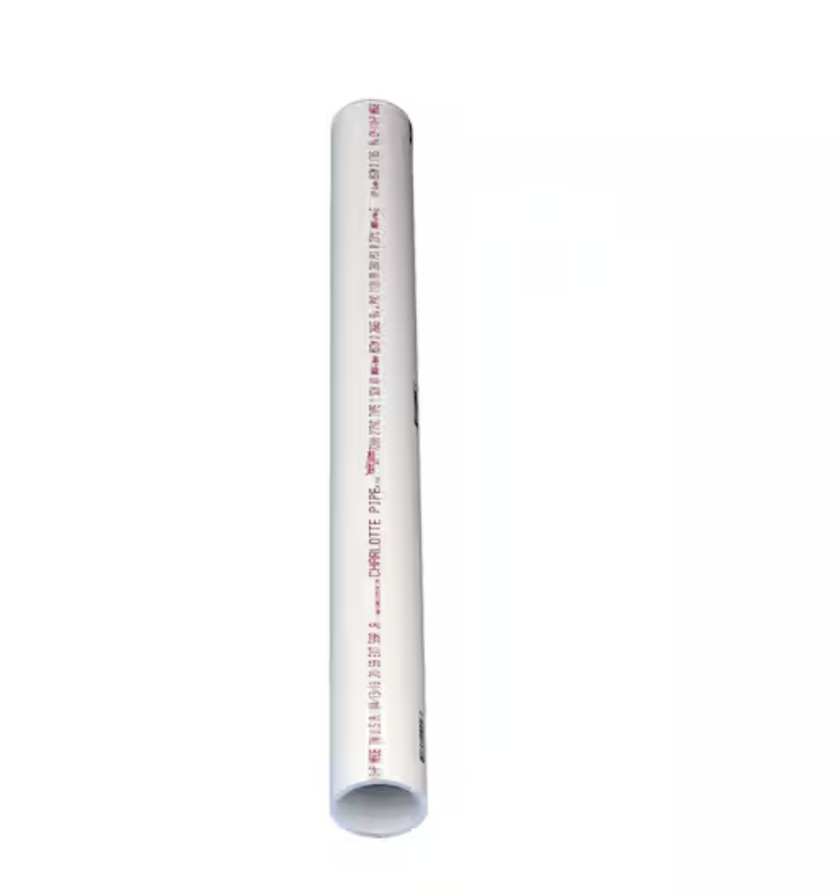</td>
  </tr>
  <tr>
    <td><a href="https://www.homedepot.com/p/Charlotte-Pipe-1-2-in-PVC-Side-Outlet-90-Degree-S-x-S-x-S-Elbow-Fitting-PVC025100600HD/300335067">1/2" PVC 4-way Elbow</a></td>
    <td align="center">4</td>
    <td>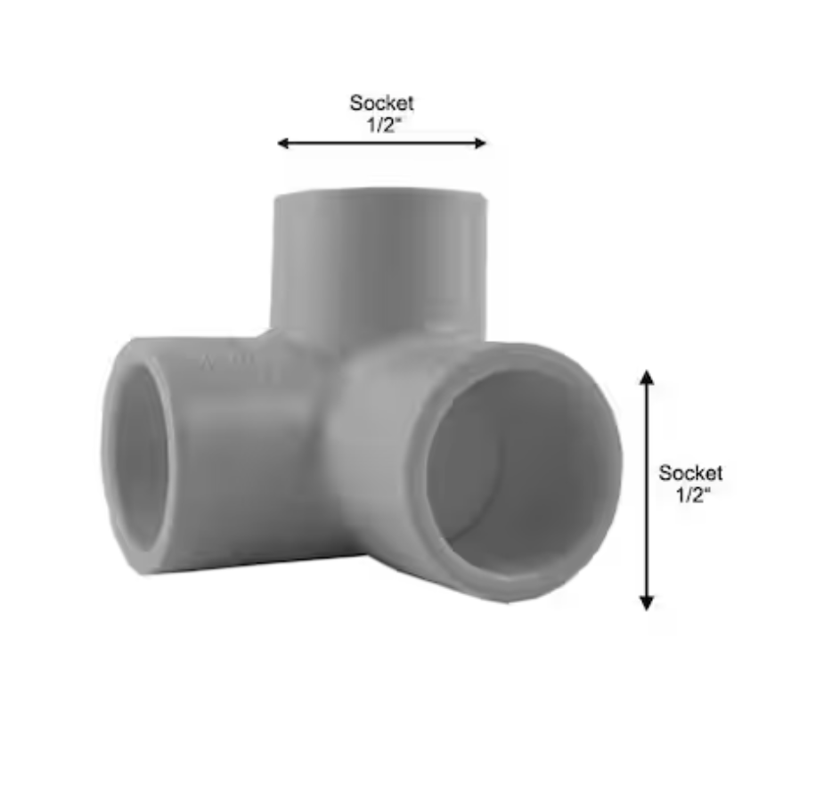</td>
  </tr>
  <tr>
    <td><a href="https://www.walmart.com/ip/Hollow-Swimming-Rod-Hollow-Foam-Pool-Noodles-P8C8/5796385463?classType=VARIANT&athbdg=L1400&selectedSellerId=101664769">Pool Noodle</a></td>
    <td align="center">1</td>
    <td></td>
  </tr>
</table>

 

## Fabrication Guide

The disassembled frame can be seen below. We need to fabricate these parts from our materials before we can assemble the frame. It is reccomended to start with the 1/2" pipe. Once the pipe pieces are cut, we can start assembling the frame. Some of the parts are from the Sea Mate Angelfish ROV kit. Those parts are essential to assembling the frame. They are not necessary in the fabrication process for the frame. The Sensor kit is also not necessary at this stage. 

 

  
  
<em>JAR JAR ROV Disassembled Frame</em>

> The sensing pod and its sensors are not required for the fabrication process.
 

#### Fabricated Parts List

| Quantity | Component | Size | Function |
|:--------:|-----------|-------------|----------|
| 8 | Long horizontal pipes | 155 mm | Frame lengthwise beams |
| 3 | Medium vertical pipes | 130 mm | Vertical pillars |
| 2 | Short horizontal pipes | 115 mm | Frame breadthwise beams |
| 11 | Very short horizontal pipes | 45 mm | Connecting pieces |
| 11 | Tee connectors | 1/2" Tees | Connectors-tee |
| 4 | Elbow Connectors | 1/2" 4-way Elbow | Connectors-elbow |
| 1 | Sea Mate Angelfish ROV Thruster kit | - | Sea Mate thrusters |

 

## Assembly Guide

You need to build the thruster joint for the Sea Mate ROV. It is reccomended to build the entire ROV electronics before starting the final assembly. Once all the parts are fabricated, you can start assembling the frame as shown below. Use the images as a guide to assembling the ROV frame. All of the parts are highlighted in their respective final positions. 

 

### Long Horizontal Pipes (8)
*Frame lengthwise beams*

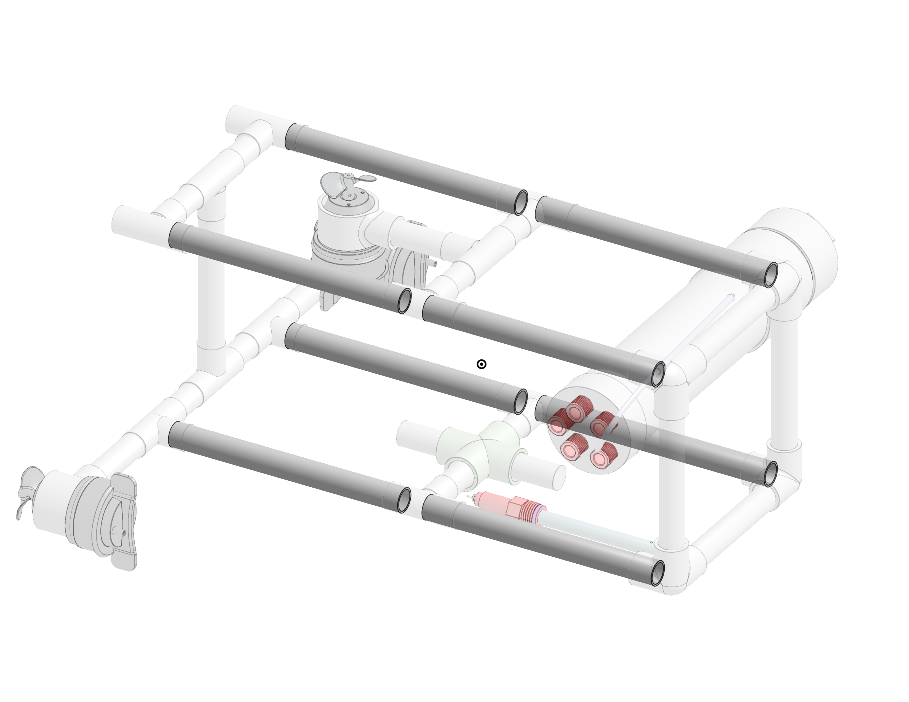

### Connectors
*Elbows + Tees*

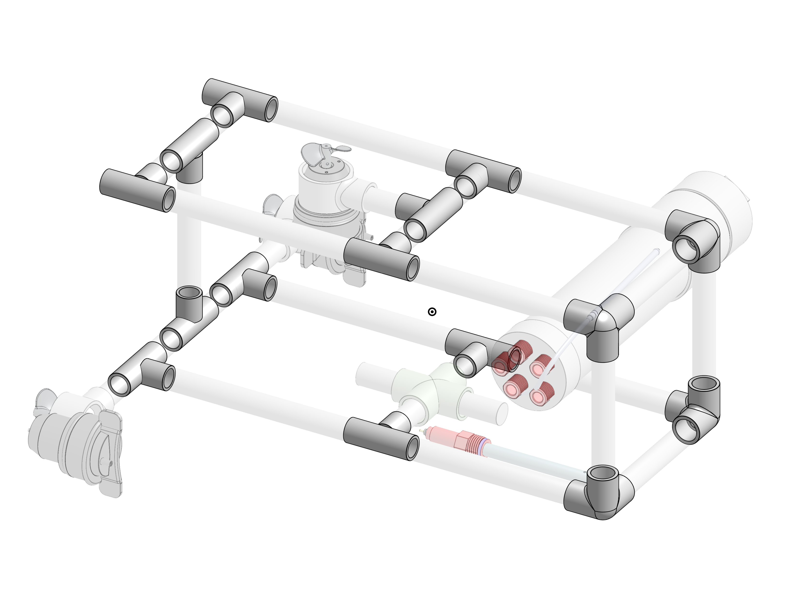

> Note: Once you attach a pipe to a connector, make sure to hammer it in place with a rubber mallet. 

### Medium Vertical Pipes (3)
*Vertical pillars*

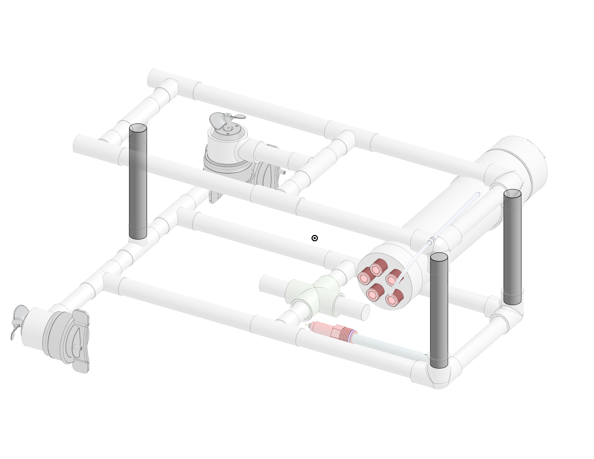

### Short Horizontal Pipes (2)
*Frame breadthwise beams*

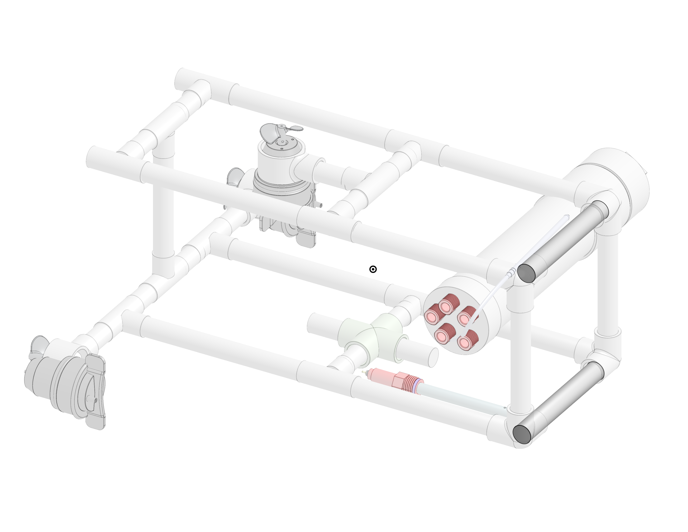

### Very Short Horizontal Pipes (11)
*Connecting pieces*

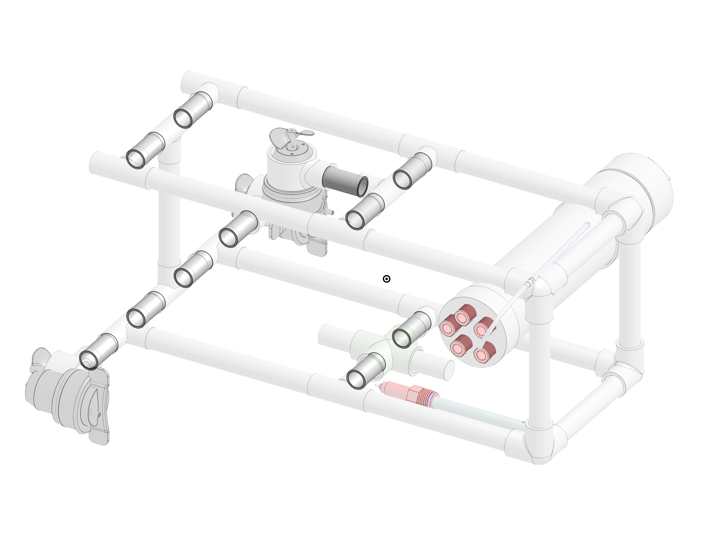

### Propulsion

*Sea Mate Angelfish ROV Thruster Kit*

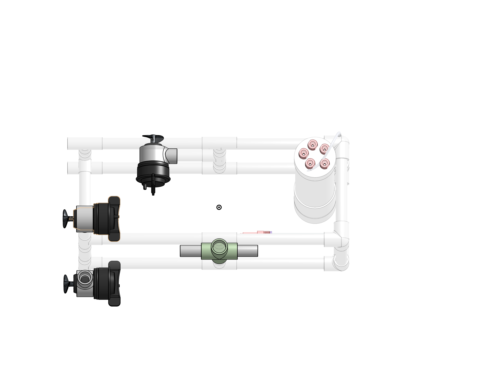

 

## Ballasting
Make sure there are no bends in the frame. You can now attach the ballast (pool noodle pieces) and the sensor pod. Use the following image as a guide. Adjust the ballast accordingly.

  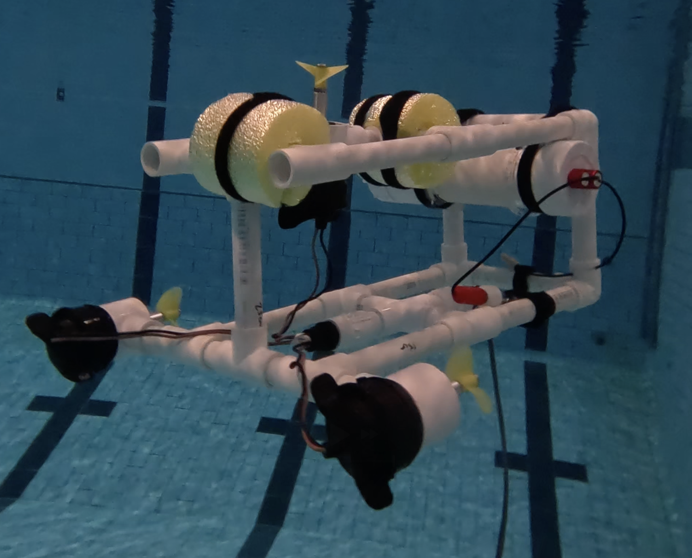
  
<em>JAR JAR ROV in the Pool</em>

> When you attach the ballast, make sure that the sensor pod is attached to the side closer to the surface.
